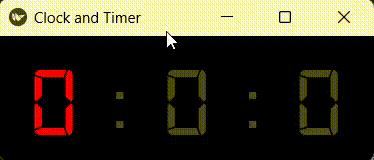

# kivy Timer and Clock

### Índice

* [Descrição do projecto](#descrição-do-projecto)
* [Funcionalidades](#funcionalidades)
* [Aplicação](#aplicação)
* [Ferramentas usadas](#ferramentas-usadas)
* [Acesso ao projecto](#acesso-ao-projecto)
* [Abrir e rodar o projecto](#abrir-e-rodar-o-projecto)
* [Desenvolvedor](#desenvolvedor)

## Descrição do projecto

Temporizador e relógio digital para ajudar na produtividade e na qualidade de vida do desenvolvedor.
Tendo em mente aprender Kivy, decidi criar um Temporizador. Essa ideia surgiu na necessidade de um temporizador para controlar o tempo em que fico codando, visto que o Ubuntu não tem um temporizador decidi criar este enquanto aprendia kivy, por favor fiquem avontade para explorar este simples projecto.

---
## Funcionalidades

`Funcionalidade 1:` Podemos mudar entre relógio e o temporizador através do teclado, `T` para o temporizador e `C` para o relógio.

`Funcionalidade 2:`
### Temporizador
O tempo no temporizador é ajustado usando o teclado, seta _**esquerda**_ e _**direita**_ para navegar entre hora, minuto e segundo, as setas _**para cima**_ e _**para baixo**_ são usadas para aumentar ou diminuir o tempo, _**Enter**_ é usado para iniciar e para parar o tempo, _**Espaço**_ é usado para pausar e continuar, _**Esc**_ para fechar a aplicação.

Quando o tempo terminar o temporizador irá emitir um som, para parar basta precionar _**Enter**_.

---
## Aplicação

---
## Ferramentas usadas

    
    

---
## Acesso ao projecto
Você pode [acessar o código fonte do projecto](https://github.com/JoZangui/Timer/tree/main)

---
## Abrir e rodar o projecto
Abra o seu terminal no directorio do projecto e digite `python timer.py`.

---
## Desenvolvedor

    

[Joaquim Zangui](https://github.com/JoZangui)